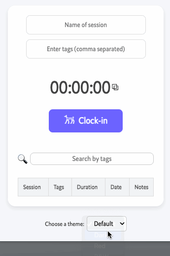
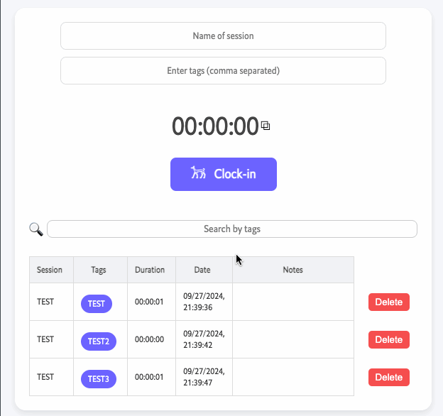

# 🐶 Dog Day | A Minimalistic Task Management Extension

My partner needed a simple way to track how long their day-to-day tasks took, so I made this terrible little Chrome extension to give them a way to do it. It probably won't be maintained unless they ask for new features!

## ✨ Features
### 🎨 Themes
Spice your extension up with a few pretty poorly made extension themes!

### 🏷️ Tagging
Tag your sessions and review them later with the search bar!

### 📝 Notes
Take notes about your sessions!

### 📈 Sorting
Sort all of your previous sessions by any of the parameters in the session table!

### ⏱️ A pop-out timer
Pop the timer out so you don't need to keep the extension open to track your current session's time! It even carries over the theme that you're using!
